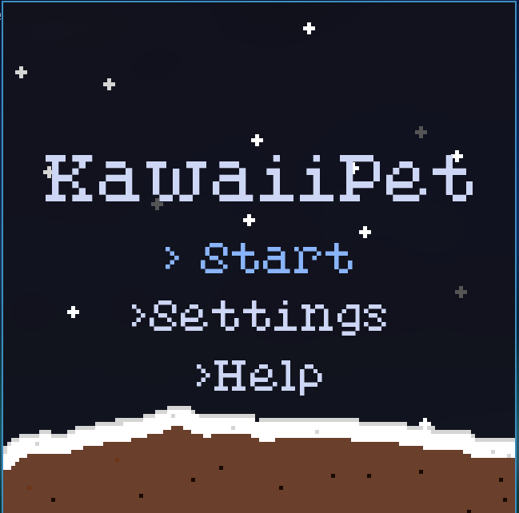
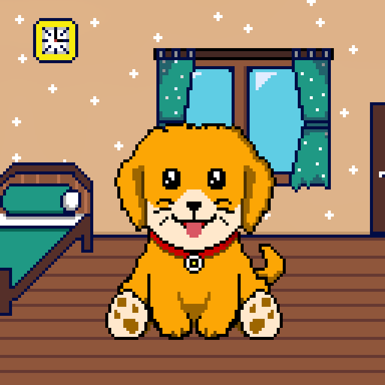
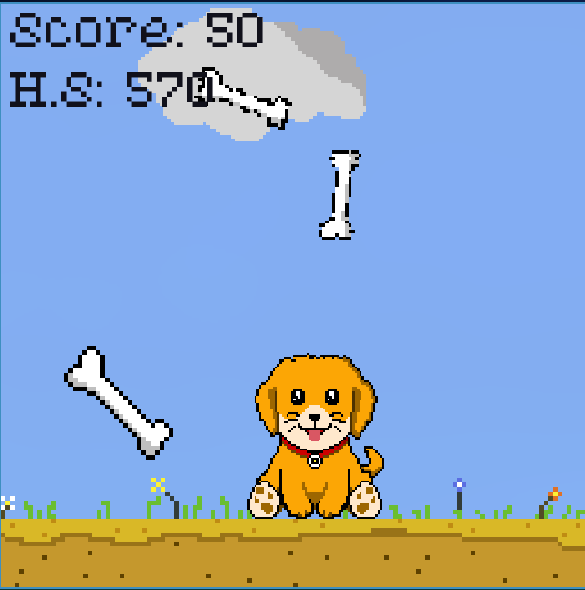
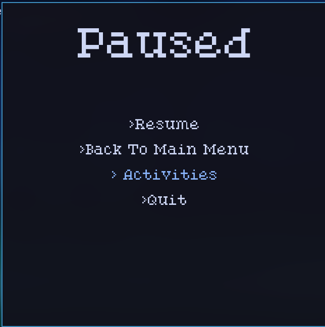
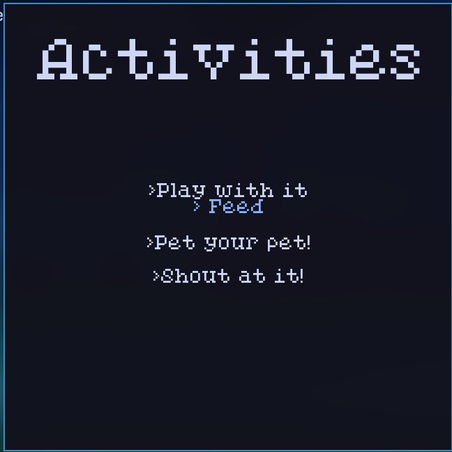

# KawaiiPet 🐶

A pet simulator game with cute pets! (Includes only a dog as of now..).
You can feed it, pet it , play with it , or even shout at it!(Please don't do that!)
Its originally made for [Hackapet](hackapet.hackclub.com) organised by Hackclub(Thanks acon and dari, and others!)
written with ❤️ in Python :)

> [!NOTE]
> The circuitpython version is not a complete port of the game yet, its a wip

## Features 😎

- Multiple activities to do with the pet, including feeding, petting, scolding, and playing
- Includes a fun minigame
- Minigame has highscore, and gets gradually harder
- The settings option allows you to control SFX and BGM.
- Based on Catppuccin:)
- I made all the sprites myself!
- Multiple controls for the same thing for ease of usage

## Demo
[Video Link](https://cloud-fgf2azwgd-hack-club-bot.vercel.app/0kawaiipet_demo.mp4) : Check this out please!

## Dependencies

The dependencies include: 

- [pygame](https://github.com/pygame/pygame)

- [toml](https://pypi.org/project/toml/)

<h2>
    Controls 
</h2>
There are different type of controls for doing the same thing, just for simplicity and a user friendly behaviour.

- To select upper option --> k,up arrow key, scroll up
- To select bottom option --> j,down arrow key, scroll down
- Choose an option --> Press enter, left click(anywhere on screen)
- Move player to left --> Press h or left arrow key
- Move player to right --> Press l or right arrow key
- To open up menus -> press Esc

## To-Do 🛠️
- Optimize the game (Its heavily unoptimized now :( )
- Make a circuitpython version for submission
- Add a status bar, to make it more fun
- Add a sleep feature, so that the pet can sleep too!
- Add more pets
- Add more maps

## Known bugs 🐞
- In the activities list, the feed text is a little misaligned
- Sometimes the background music doesn't immediately play even after turning it on in the settings

## Contributing 🤝

Everyone is welcome to contribute to the code!

You can also raise an issue, or suggest any features that you think would be great :)

> ✨ Please star this repository if you liked this project 😁
