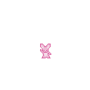
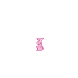
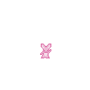
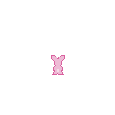
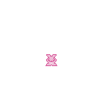

# How To Play Rabeat
Rabeat is a collection of rabbit-themed rhythm games! To access a more detailed description, visit the [Readme](./README.md).

Read on to find instructions for playing this game!

## Home Screen
Press any button to advance to the next screen.

## Difficulty Screen
The game has different difficulty levels, each with rhythms of varying difficulty.

Depending on the player's device, to change the difficulty, press:
- Center button (on Tamagotchi)
- Space
- Page Up
- 2

To select the highlighted difficulty, press:
- Right button (on Tamagotchi)
- Enter
- Return
- Page Right
- 3

## Game Screen
The objective of the game is to match the pose with the same timing and movement as the rabbit model, who stands on a log.

The correct timing is indicated by signs below the player's rabbit, which indicate how many beats there are left before the player must strike a pose.

There are 4 left, 4 right, and 2 neutral poses, and the player must hit different buttons on the rhythm to pose in the correct direction.

If the pose is towards the left, press:
- Left button (on Tamagotchi)
- Page Left
- 1

If the pose is neither left or right, meaning it is neutral, press:
- Center button (on Tamagotchi)
- Page Up
- 2

If the pose is towards the right, press:
- Right button (on Tamagotchi)
- Page Right
- 3

    

    Click here to see a breakdown of which rabbit poses are considered left, right, and neutral.
    

### Left Poses

### Right Poses

### Neutral Poses

If the player clicks a button in the correct direction, depending on the timing, it will be rated as Perfect, Great, Good or Miss.
This affects the total score that the player will receive, with a 12 being a perfect score (all perfects) and a 0 being the lowest possible score (all misses).
Listen carefully to the music and make sure to click the button on beat to maximize your score!

## Menu (Pause) Screen
If a player wishes to pause the game or change settings, they may do so through the Pause Menu.

To access the pause menu during the game, hold:
- Any two of the following: Left Button, Right Button, Center Button (on Tamagotchi)
- Any two of the following: 1, 2, 3
- Any two of the following: Page Left, Page Up, Page Right

To change the menu option that is highlighted, press:
- Center button (on Tamagotchi)
- Space
- Page Up
- 2

To select the highlighted menu option, press:
- Right button (on Tamagotchi)
- Enter
- Return
- Page Right
- 3

## How To Play Screen
The player can find a QR Code to instructions for playing the game by accessing the How To Play screen. 
Once entered, any button may be pressed to exit it.